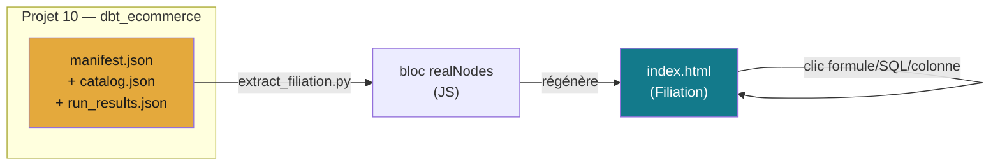

# Projet 14 — Filiation : documentation vivante et interactive de traçabilité

> On demande souvent d'où vient un chiffre. La réponse habituelle est un
> classeur Excel qui date de six mois, ou un aller-retour avec l'équipe data.
> **Filiation** répond directement dans l'outil : on clique sur n'importe quel
> élément — un indicateur, une colonne, une table — et on voit sa formule ou
> son SQL, puis on remonte, niveau par niveau, jusqu'à la donnée brute et sa
> source. Le [Projet 11](../projet-11-gouvernance) documente déjà le lignage
> techniquement (dbt docs, pensé pour l'équipe data) ; celui-ci l'expose sous
> une forme cliquable, pensée pour quelqu'un qui ne lit pas de DAG.

## 🧬 Ce que fait le projet

Une page unique (`index.html`, aucune dépendance) avec deux jeux de données,
au choix dans la barre latérale :

- **Démo** — un scénario fictif (marge brute, CAC, taux de conversion...) sur
  deux domaines (Ventes/Marketing), pour démontrer le concept sans dépendre
  d'un vrai projet.
- **Projet réel** — introspecté depuis le [Projet 10](../projet-10-pipeline-elt)
  (`dbt_ecommerce`) : rien n'est inventé, tout vient de `manifest.json` /
  `catalog.json` / `run_results.json`.



Pour chaque élément du jeu réel : schéma et types de colonnes, dépendances
(`ref()`/`source()` cliquables directement dans le vrai SQL dbt), et les tests
dbt réels avec leur statut du dernier run (unicité, non-nullité, intégrité
référentielle, valeurs autorisées). Là où dbt n'a pas de description, la page
l'affiche honnêtement plutôt que d'improviser un texte.

Toute modification passe par le système source : chaque donnée brute affiche
un renvoi (maquette) vers sa fiche native plutôt qu'un formulaire d'édition
maison — principe de gouvernance détaillé dans le
[Projet 11](../projet-11-gouvernance) : un ERP applique des règles métier
qu'une écriture directe en base contournerait.

## 📊 Résultats chiffrés

| Jeu de données | Nœuds | Détail |
|---|---|---|
| Démo (fictif) | 15 | 2 domaines, 5 niveaux de profondeur |
| Projet réel (dbt_ecommerce) | 13 | 5 sources + 4 staging + 3 dimensions + 1 fait |
| Tests dbt affichés (jeu réel) | 28 | statut réel du dernier `dbt run` — 28/28 PASS |

## 🗂️ Contenu

```
projet-14-filiation/
├── README.md
├── index.html                    ← l'outil, page unique auto-suffisante
└── scripts/
    └── extract_filiation.py      ← régénère le bloc "Projet réel" depuis un target/ dbt
```

## 🚀 Lancer / régénérer

Ouvrir `index.html` dans un navigateur — aucune dépendance, aucun serveur.

Pour rafraîchir le jeu "Projet réel" après un changement dans le Projet 10 :

```bash
cd projet-10-pipeline-elt/dbt_ecommerce
dbt run && dbt test && dbt docs generate   # régénère target/manifest.json, catalog.json, run_results.json

cd ../../projet-14-filiation
python scripts/extract_filiation.py        # relit target/ et met à jour index.html
```

Le script accepte `--target` (autre dossier `target/` dbt) et `--html` (autre
fichier à mettre à jour) pour pointer vers un autre projet dbt.

## ⚠️ Limite assumée

`index.html` est une page statique : elle ne se connecte pas à une base en
direct (pas de backend). "Se met à jour toute seule" veut dire *relancer le
script après chaque `dbt run`*, pas une synchronisation live — pour ça il
faudrait une vraie application avec un backend interrogeant la base à chaque
chargement.
